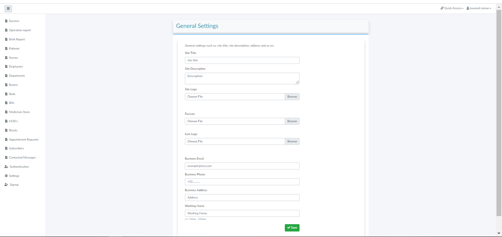

# Hospital Management System


## Front End


## Back End



## Database Tables


## Installation

Follow these instructions to set up and run the project locally on your Machine.

### Prerequisites

- [Git](https://git-scm.com/)
- [Composer](https://getcomposer.org/)
- [PHP](https://www.php.net/)

### Installation

1. Clone the repository:

```bash
   git clone https://github.com/ymahak/hospital-management.git
```
 ```bash
   cd hospital-management
```

 ```bash
composer install
```
 ```bash
cp .env.example .env
```
```bash
php artisan key:generate
 ```
```bash
php artisan storage:link
```
 ```bash
 php artisan migrate:fresh --seed
```
 ```bash
 php artisan serve
```

## Admin Credentials
Admin: 
```bash 
Mahakyadav04@gmail.com
```
Password: 
```bash
HelloThere15
```

## If you like our project please leave a star ❤

